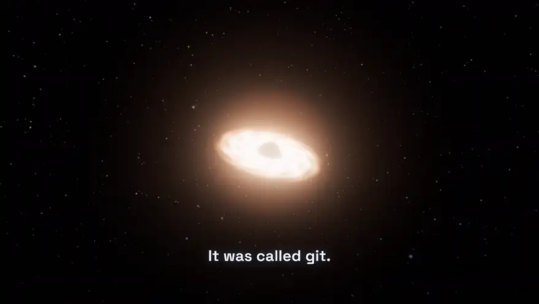

# Commitverse

[](https://krapcys1-maker.github.io/commitverse/)
[-ffcf87?style=flat-square)](https://krapcys1-maker.github.io/commitverse/media/commitverse-bigbang.mp4)
[](.github/workflows/universe.yml)
[](https://github.com/krapcys1-maker/commitverse/stargazers)
[](LICENSE)

**The universe of open source.** Every GitHub account is a world and every repository is a city on it. Every file is a building, and every line of code is a floor. The worlds gather in galaxies by the kind of code they write. As projects grow, they migrate between galaxies, so the universe changes along with GitHub, every day.

[](https://krapcys1-maker.github.io/commitverse/media/commitverse-bigbang.mp4)
<sub>▶ **Click to watch the film with sound**: *The Big Bang of open source* (72 s, 1080p). It starts at the git singularity, watches the worlds light up year by year, lands on @karpathy's world, and goes down into llm.c until it reaches one line of CUDA. Every frame is the live app, rendered frame by frame by [tools/video](tools/video), and the soundtrack is synthesised to match. Also on the [release page](https://github.com/krapcys1-maker/commitverse/releases/latest).</sub>

**[Open the Commitverse →](https://krapcys1-maker.github.io/commitverse/)**

## A cluster of galaxies

The Commitverse is 14 galaxies around the git singularity, and every world belongs to exactly one of them:

| Galaxy | Who lives there |
|---|---|
| ✦ **Titan Galaxy** | The giants of GitHub: every world with 100,000 stars or more (Microsoft, Google, OpenAI, Anthropic, freeCodeCamp…) |
| **AI Galaxy** | Worlds that build AI: models, agents, the tools around them |
| **Rising Galaxy** | Protostars: repositories born in the last year and climbing fast |
| **Python, JavaScript, TypeScript, Rust, Go, C & C++, JVM & .NET, Apple & Mobile, Functional, Scripting** | Everyone else, by the family of their main language |
| **Silent Galaxy** | Worlds that went quiet: archived, or nothing pushed for two years |

**It's alive.** A [workflow](.github/workflows/universe.yml) reseeds the universe from GitHub every day and logs what moved. When a protostar passes 100,000 stars it *ignites*: it leaves the Rising Galaxy for the Titans, and you can watch it cross the cluster as a comet. Worlds that change their main kind of code migrate too, and every move becomes galactic news.

**Join it.** ⭐ [Star this repository](https://github.com/krapcys1-maker/commitverse) and your world appears in its galaxy at the next daily update.

## Your world in your README

[](https://krapcys1-maker.github.io/commitverse/?planet=karpathy)

Every world has a card. It is an animated SVG that wears your main language's climate and your level of civilisation: a moon, satellites, rockets and orbital rings, with city lights on the night side and an aurora if you shipped this month. Get yours from **Share this world** on your planet, or let a GitHub Action redraw it every day. Add this to `.github/workflows/commitverse.yml` in your profile repository (`github.com/<you>/<you>`):

```yaml
name: Commitverse world
on:
  schedule: [{ cron: '0 3 * * *' }]
  workflow_dispatch:
permissions:
  contents: write
jobs:
  card:
    runs-on: ubuntu-latest
    steps:
      - uses: actions/checkout@v4
      - uses: krapcys1-maker/commitverse/card@main
      - run: |
          git config user.name "github-actions[bot]"
          git config user.email "41898282+github-actions[bot]@users.noreply.github.com"
          git add commitverse-world.svg
          git commit -m "Commitverse: my world today" || exit 0
          git push
```

Then put it in your README:

```markdown
[](https://krapcys1-maker.github.io/commitverse/?planet=<you>)
```

## A film of any repository

Land in any city and press **🎬 Film**. You get 29 seconds, recorded in your browser, with music:
- you arrive through the clouds;
- the city rebuilds itself from its history (or rises from its files);
- you ride an elevator up its tallest tower while its code scrolls past;
- the end card closes it.

It is saved as an MP4 you can post anywhere.

## Travel

It's one continuous zoom: **universe → galaxy → star system → world → city → building → line of code**. A scale ladder on the left shows where you are.

- **Zoom past the limit and keep going.** At the edge of a scale, keep scrolling (or pinching) and you move to the next one:
  - zoom out of a city and you rise through the clouds to its world;
  - out of a world and you reach its star system, then its galaxy, then the whole cluster;
  - zoom in and you go back down, into the galaxy, the star or the city under your cursor, and finally the building.
- **🚀 Fly me home.** Type your GitHub login on the first card and the autopilot takes you from the whole cluster into your galaxy, your star system and your world. Share the journey: `…/commitverse/?home=<login>`.
- **Click anything** to fly straight there.
- **Search** `@anyone` to fly to their world, or `owner/repo` to land in that city.
- **Turn back time.** Every galaxy has a time machine: scrub through the years, or press ▶ to watch it form from 2008 to today.
- **Turn the sound on** (🔈) for an ambient score generated live in your browser: chords, bells, space wind, and effects for travel, rockets and impacts.

| The galaxy | A world | A building's code |
|---|---|---|
|  |  |  |
| Every star is a real GitHub account. On a spiral, older worlds sit nearer the core: the galaxy grew outward the way GitHub did. | A person's repositories are cities on their continents. The level of civilisation comes from their stars; the lights come from recent work. | Files are buildings, folders are districts, and a building's floors are its lines of code. Scroll the code to ride the elevator. |

## Any repository is a city

Every world shows all of its maker's repositories, and you can land in any of them:
- **Surveyed cities** (prebaked, or mapped by the [mapping service](server/README.md)) carry their whole history. Replay it as a timelapse with demolitions, release rockets and asteroid impacts.
- **Any other public repository** is raised live from the GitHub API in four requests. You get the tree of files at HEAD, and the files the last 100 commits touched are lit. One click on *Survey its whole history* replaces the snapshot with the full city.
- **At night the streets are alive**: thousands of cars, headlights one way and tail lights the other, and busier traffic in a busier repository.


<sub>@karpathy's world, rendered with Blender Cycles from real GitHub data. 494,341 ★ make it a Level 6 *Ecumenopolis*.</sub>

**Every world looks like its maker.** Rendered with Blender from the same rules as the browser:

| @sindresorhus · JavaScript desert · *Galactic* | @torvalds · C ice world · *Ecumenopolis* |
|---|---|
|  |  |

Every visual rule is a measurement, so nothing is decoration:

| You see | It means |
|---|---|
| Which galaxy a world is in | Its stars (Titans), its topics (AI), its activity (Silent) or its main language |
| A world's level of civilisation (Dust → Galactic) | Total stars of the account, on a log scale: satellites at Colony, a moon base at Civilisation, a spaceport launching rockets at Industrial, an orbital ring and a space elevator at Spacefaring, a second ring at Galactic |
| The kind of planet | Its main language: Python worlds are temperate, JavaScript worlds are deserts, Rust worlds rust, C worlds are ice |
| City lights on the night side | Where work happened recently; quiet code goes dark |
| A star with megastructures | An organisation. Its repositories orbit as ring arcs, the flagship becomes a Dyson ring, and its members are the worlds further out |
| A comet across the cluster | A world migrating between galaxies, or a protostar that ignited into a megastar |
| Aurorae over a world's poles | It shipped this week (bright) or this month (faint) |
| Fleets of ships around a world | Its contributors, from Level 5 (Spacefaring) up |
| Traffic in a city's streets | How busy its repository is lately |
| git at the centre | Everything here is built with it |

## Live events

| Event | What it is |
|---|---|
| ✦ **Ignition** | A protostar passes 100,000 ★ and migrates to the Titan Galaxy |
| ↗ **Migration** | A world moves to another galaxy |
| ⭐ **New world** | Someone starred the repo and joined |
| ✷ **Supernova** | One of this year's fastest-rising repositories flares in the Rising Galaxy |
| 🚀 **Release rocket** | A real release tag lifts off the tallest building of its city, and off its world's spaceport |
| ☄ **Asteroid impact** | One of a city's biggest deletions strikes the district it emptied |

## Honest history

| Express, mid-2011 | Express today |
|---|---|
|  |  |

Cities keep their whole past. Files are followed through renames, and deleted code is demolished on screen. In Express, **66% of all lines ever added went into paths that no longer exist**, so a city built only from today's files would miss most of its story.

## Run it

```bash
npm install
npm run dev
```

Grow the universe yourself:

```bash
GITHUB_TOKEN=$(gh auth token) node tools/universe/seed.mjs        # the galaxies, the migration log, showcase worlds
GITHUB_TOKEN=$(gh auth token) node tools/universe/seed-orgs.mjs   # organisation star systems
npm run ingest -- karpathy/nanoGPT                                # survey a city's whole history
node tools/universe/events.mjs                                    # supernovae, rockets, impacts
```

To survey cities on demand, run the mapping service and point the site at it:

```bash
node server/server.mjs      # or: docker compose -f server/docker-compose.yml up -d
npm run dev                 # then open http://localhost:5173/?api=http://localhost:8787
```

## Make the film

The film is the app itself in *director mode*. `?director` plays it live, and `?director&capture` lets a script step it frame by frame, so the result is the same on any machine. You need ffmpeg and Microsoft Edge or Chrome.

```bash
npm run build && npx vite preview --port 4173
node tools/video/capture.mjs --base http://localhost:4173/ --out video/bigbang-silent.mp4
node tools/video/score.mjs --cues video/bigbang-silent.cues.json --out video/score.wav
ffmpeg -i video/bigbang-silent.mp4 -i video/score.wav -c:v copy -c:a aac -b:a 192k video/bigbang.mp4
```

The soundtrack has no samples. Pads, plucked strings, FM bells, drums and effects are synthesised in [score.mjs](tools/video/score.mjs) and cut to the timeline. The asteroid impacts land exactly where the capture saw them happen.

## Posters with Blender

```bash
blender -b -P tools/blender/render_planet.py -- --planet public/universe/planets/karpathy.json --out world.jpg
blender -b -P tools/blender/render_city.py -- --data public/data/expressjs-express.json --out city.jpg --at 2011-06-01
```

## Status

Working now:
- the cluster of 14 galaxies, with daily migrations and joining by star;
- worlds with levels, styles and night lights;
- organisation star systems with megastructures;
- the continuous zoom from the universe to a line of code;
- a city for every public repository, with the whole history for surveyed ones;
- timelapses with demolitions, release rockets and asteroid impacts;
- the code elevator;
- the film, films of any city recorded in the browser, and the Blender posters;
- world cards for profile READMEs, drawn by a GitHub Action.

Next up:
- an AI guide;
- contributors' worlds orbiting the systems they work in;
- the stargazer sky over each city;
- a hosted mapping service, so any city's history can be surveyed from the site.

See [VISION](docs/VISION.md), [LORE](docs/LORE.md), [UNIVERSE_TECH](docs/UNIVERSE_TECH.md), [ARCHITECTURE](docs/ARCHITECTURE.md) and [BENCHMARK](docs/BENCHMARK.md).

## Credits

- Night sky: **NASA/Goddard Space Flight Center Scientific Visualization Studio**, Deep Star Maps 2020. Gaia DR2: ESA/Gaia/DPAC.
- Atmospheric scattering after [wwwtyro/glsl-atmosphere](https://github.com/wwwtyro/glsl-atmosphere) (Unlicense).
- Simplex noise: [ashima/webgl-noise](https://github.com/ashima/webgl-noise) (MIT).
- Built with [three.js](https://threejs.org), [Vite](https://vite.dev), [highlight.js](https://highlightjs.org), [Playwright](https://playwright.dev), [ffmpeg](https://ffmpeg.org) and [Blender](https://www.blender.org).
- Data: the public GitHub API and git history.

## License

[MIT](LICENSE)
