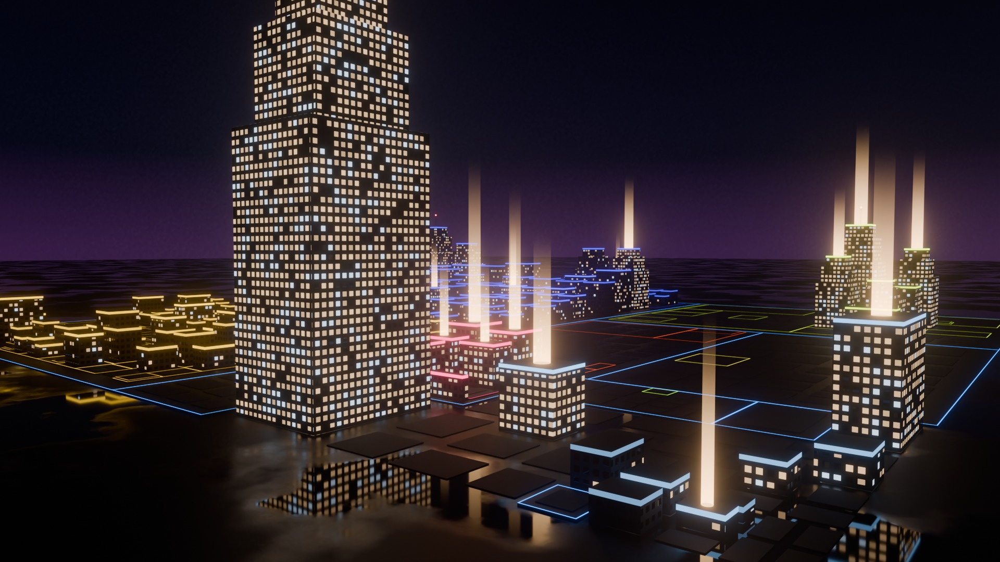
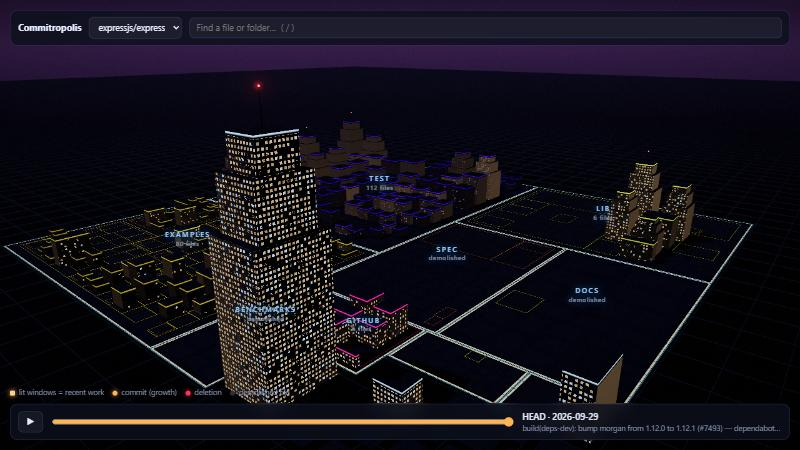

# Commitropolis

**Fly through any Git repository as a 3D city at night.** Folders are districts, files are buildings (taller = more lines of code), and the windows are lit where people worked recently. Press play to watch the whole commit history build the city, including the parts that were later torn down. Click a building to walk in and read its code.


<sub>`expressjs/express`, rendered with Blender Cycles from the same data the browser uses ([how](#posters-with-blender)).</sub>

| Express, mid-2011 | Express today |
|---|---|
|  |  |

In 2011 the middle of the Express city was `docs/`, which moved out in 2012. Today its lots are empty. Most code-city tools can't show this, because they only know the files that exist *now*. In Express, **66% of all lines ever added went into paths that no longer exist.**

> **Status: early prototype.** In the browser: the night city, the history timelapse, search with fly-to, deep links, and walking into buildings to read their code. Offline: poster renders with Blender. The AI guide and video export are designed but not built yet. See the [roadmap](docs/ARCHITECTURE.md#roadmap).

## In the browser

| The city | Walking into a file |
|---|---|
|  |  |

**A building is its file, and its floors are the lines.** Open a building and its code appears beside it. As you scroll, the camera rides an elevator up the facade and the floors holding the lines on screen light up. Buildings in the way dissolve (x-ray).

## Quick start

```bash
npm install
npm run dev              # opens the bundled Express city
```

Build a city from any repo (GitHub URL, `owner/repo`, or a local path):

```bash
npm run ingest -- https://github.com/facebook/react
npm run ingest -- ../my-private-repo
```

The city appears in the repo picker. Data is written to `public/data/<slug>.json`.

## Controls

| | |
|---|---|
| Drag / scroll | orbit / zoom (the camera circles slowly until you touch it) |
| Click a building | fly to it and see its stats |
| Double-click, `Enter` or **Enter building** | open its code; scroll to ride the elevator; `Esc` to leave |
| `/` | search files and folders; Enter flies there |
| `Space` or ▶ | play the history; drag the slider to scrub |

The URL keeps the view (`?repo=…&focus=path`), so you can link someone straight to a file.

## What the city shows

Every light in the city means something:

| Code | City |
|---|---|
| Folder | District, outlined in its own neon colour |
| File | Building; footprint ∝ √(peak lines), height ∝ lines; big slender files become setback towers |
| Recent work on a file | **Lit windows.** Code nobody has touched in a long time goes dark |
| Busy district | Brighter neon crowns on its roofs |
| Commit, in the timelapse | A beam of light from the roof: warm for growth, red for deletion |
| Deleted file | Empty lot (rubble) |
| Renamed file | Same building for its whole life |
| Biggest files | Spire with a red aircraft light |

## Why another code city?

There are many. We looked at 30+ of them, from Gource and gitdiagram to a dozen 3D repo cities from 2025–26 ([RESEARCH.md](docs/RESEARCH.md)). Commitropolis bets on four things none of them combine:

1. **Honest history.** Files are tracked through renames, and deleted code gets demolished on screen.
2. **Visuals that carry meaning.** Lights are activity, beams are commits, floors are lines of code.
3. **Cinematic output.** Poster renders with Blender today; deterministic 60 fps MP4 at 16:9 and 9:16 next.
4. **An AI guide you can trust** (next). "Show me where login happens" becomes a camera tour, and every stop is checked against the actual code before the camera moves.

How it's built: [docs/ARCHITECTURE.md](docs/ARCHITECTURE.md).

## Posters with Blender

`tools/blender/render_city.py` rebuilds the same city in Blender and path-traces it with Cycles. You get real glass reflections, a wet street and haze. It needs [Blender](https://www.blender.org/download/) 5.x, and a GPU helps: on an RTX 3060 the four images in this README took 2.5 minutes in total.

```bash
blender -b -P tools/blender/render_city.py -- --data public/data/expressjs-express.json --out city.jpg
```

| Option | Default | |
|---|---|---|
| `--at YYYY-MM-DD` | HEAD | the city as it stood that day |
| `--shot low\|wide` | `low` | camera preset |
| `--res WxH` | `1920x1080` | use `1080x1920` for vertical |
| `--samples N` | `192` | Cycles samples (denoised) |
| `--beams N` | `18` | light beams over the most recently changed files |
| `--fog D` | `0.0008` | haze density, `0` for none |

## Stack

three.js (instanced buildings, procedural facade shaders, bloom) · Vite · highlight.js · a Node ingest built on plain `git` · Blender/Cycles for posters. Planned: Claude for labels and tours, Voyage AI embeddings for semantic search, Playwright + ffmpeg for video.

## License

[MIT](LICENSE)
