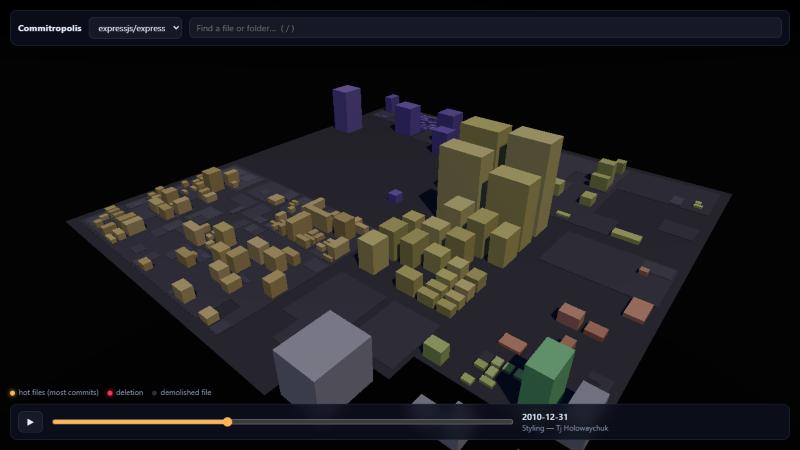

# Commitropolis

**Fly through any Git repository as a 3D city.** Folders are districts, files are buildings (taller = more lines of code), and hot files glow. Press play to watch the whole commit history build the city, including the parts that were later torn down.

| Express, end of 2010 | Express today (HEAD) |
|---|---|
|  |  |

In 2010 the middle of the Express city was `docs/`, which moved out in 2012. Today its lots are rubble. Most code-city tools can't show this, because they only know the files that exist *now*. In Express, **66% of all lines ever added went into paths that no longer exist.**

> **Status: early prototype (M0).** The static city, the history timelapse, search with fly-to and deep links all work. The AI guide and video export are designed but not built yet. See the [roadmap](docs/ARCHITECTURE.md#roadmap).

## Quick start

```bash
npm install
npm run dev              # opens the bundled Express city
```

Build a city from any repo (GitHub URL, `owner/repo`, or a local path):

```bash
npm run ingest -- https://github.com/facebook/react
npm run ingest -- ../my-private-repo
```

The city appears in the repo picker. Data is written to `public/data/<slug>.json`.

## Controls

| | |
|---|---|
| Drag / scroll | orbit / zoom |
| Click a building | fly to it, see its stats, open it on GitHub |
| `/` | search files and folders; Enter flies there |
| `Space` or ▶ | play the history; drag the slider to scrub |

The URL keeps the view (`?repo=…&focus=path`), so you can link someone straight to a file.

## What the city shows

| Code | City |
|---|---|
| Folder | District (nested plates) |
| File | Building; footprint ∝ √(peak lines), height ∝ lines |
| Many commits | Warm glow |
| Commit in the timelapse | Flash: warm for growth, red for deletion |
| Deleted file | Rubble on its lot |
| Renamed file | Same building for its whole life |

## Why another code city?

There are many. We looked at 30+ of them, from Gource and gitdiagram to a dozen 3D repo cities from 2025–26 ([RESEARCH.md](docs/RESEARCH.md)). Commitropolis bets on three things none of them combine:

1. **Honest history.** Files are tracked through renames, and deleted code gets demolished on screen.
2. **Cinematic export.** Deterministic 60 fps MP4 at 16:9 and 9:16, so "React: 10 years in 30 seconds" looks like a film, not a screen recording.
3. **An AI guide you can trust.** "Show me where login happens" becomes a camera tour, and every stop is checked against the actual code before the camera moves.

How it's built: [docs/ARCHITECTURE.md](docs/ARCHITECTURE.md).

## Stack

three.js (one instanced mesh, custom emissive "heat" shader, bloom) · Vite · a Node ingest built on plain `git`. Planned: Claude for labels and tours, Voyage AI embeddings for semantic search, Playwright + ffmpeg for video.

## License

[MIT](LICENSE)
