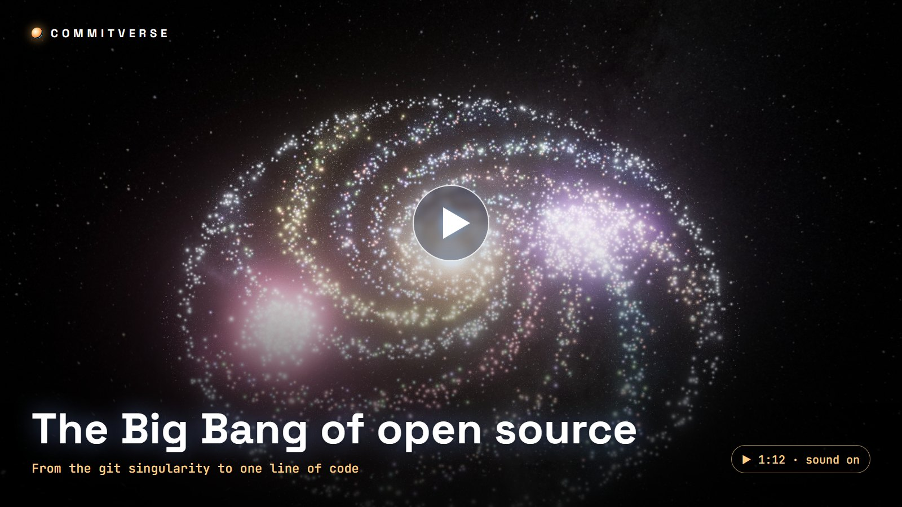
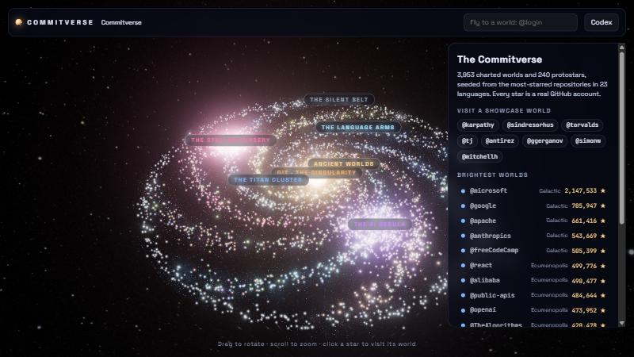
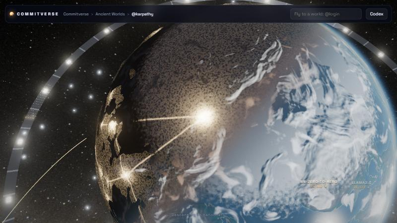
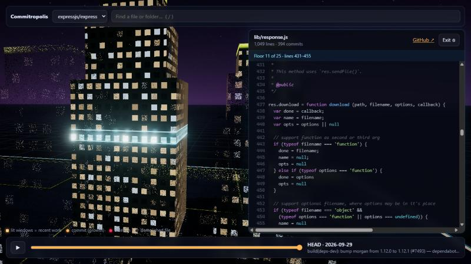
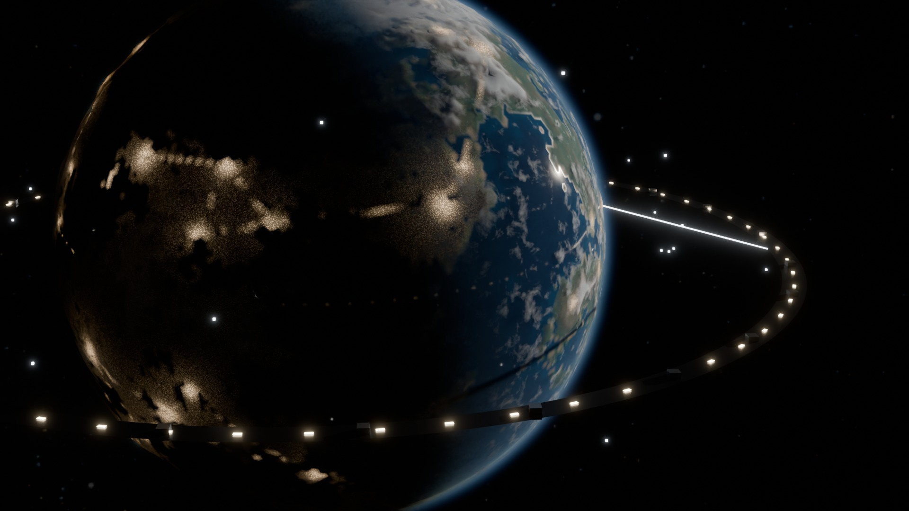
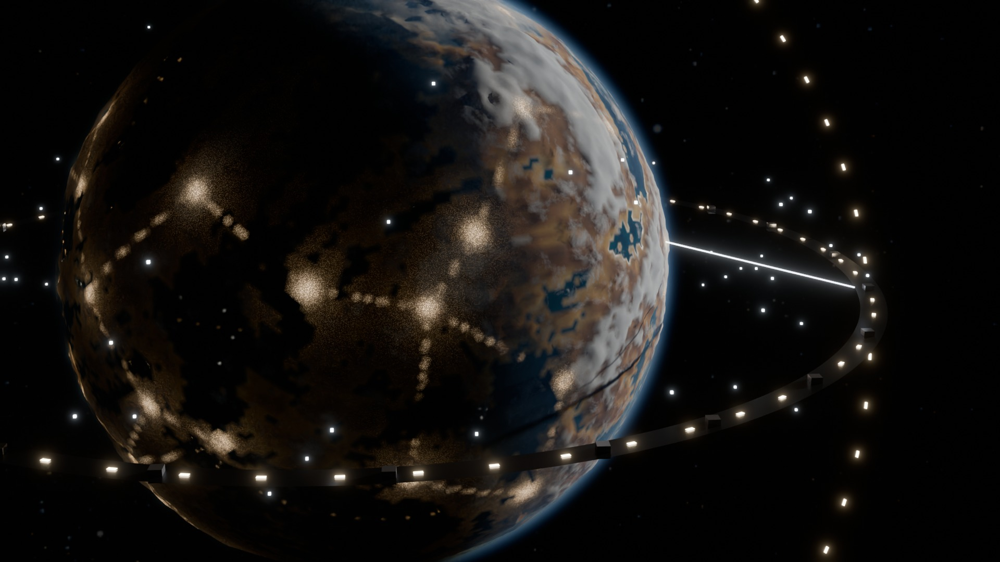
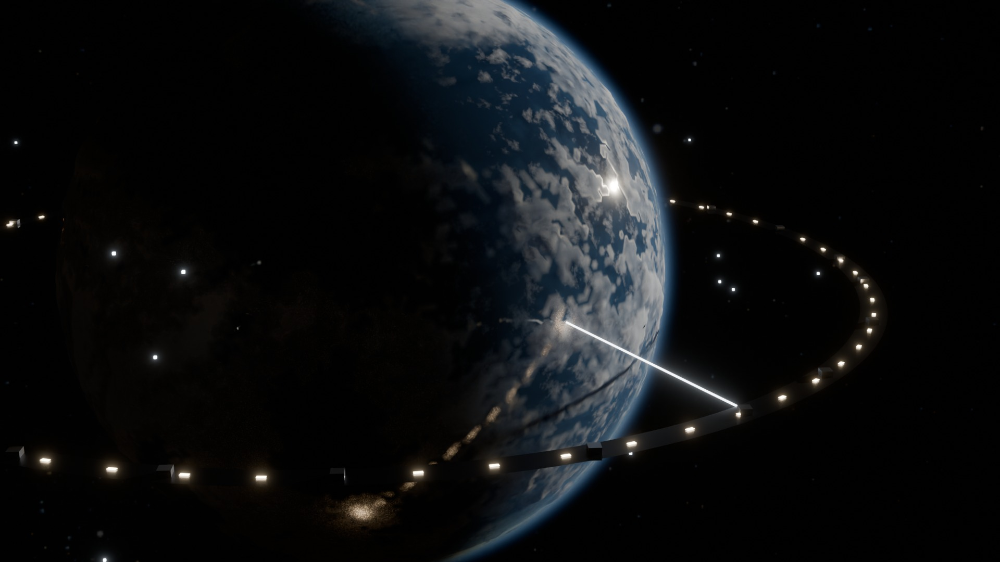
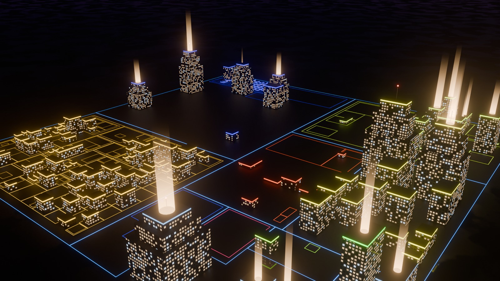
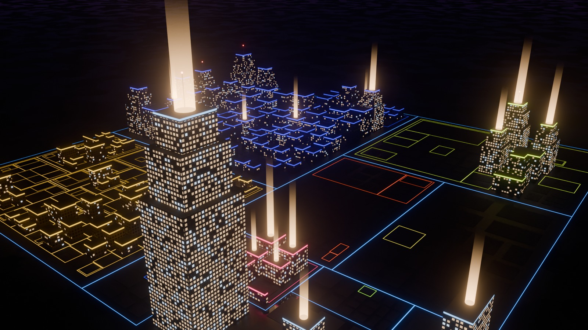

# Commitverse

**The universe of open source.** Every GitHub account is a world, every repository is a city on it, and every star is a light in its sky. Fly from the whole galaxy down to a single line of code.

[](https://krapcys1-maker.github.io/commitropolis/media/commitverse-bigbang.mp4)
<sub>▶ **The Big Bang of open source** (72 s, with sound). It starts at the git singularity, watches 3,959 worlds light up year by year, lands on @karpathy's world, and goes down into the llm.c city until it reaches one line of CUDA. Every frame is the live app, rendered frame by frame by [tools/video](tools/video), and the soundtrack is synthesised to match.</sub>

**[Open the Commitverse →](https://krapcys1-maker.github.io/commitropolis/)**

## Travel

| The galaxy | A world | A building's code |
|---|---|---|
|  |  |  |
| 3,959 real accounts in language arms and named sectors. Older accounts sit closer to the core: the galaxy grew outward the way GitHub did. | A person's repositories are cities on their continents. The level of civilisation comes from their stars; the lights come from recent work. | Land in a city to walk its history. Files are buildings, folders are districts, a building's floors are its lines of code. |


<sub>@karpathy's world, rendered with Blender Cycles from real GitHub data. 494,341 ★ make it a Level 6 *Ecumenopolis*, 5,659 ★ short of *Galactic*. Its cities are autoresearch, nanoGPT, nanochat, llm.c…</sub>

**Every world looks like its maker.** Rendered with Blender from the same rules as the browser:

| @sindresorhus · JavaScript desert · *Galactic* | @torvalds · C ice world · *Ecumenopolis* |
|---|---|
|  |  |

**One continuous zoom:** galaxy → sector → star system → world → city → building → floor → line. Every visual rule is a measurement, so nothing is decoration:

| You see | It means |
|---|---|
| A world's level of civilisation (Dust → Galactic) | Total stars of the account, on a log scale: satellites at Colony, a moon base at Civilisation, a spaceport launching rockets at Industrial, an orbital ring and a space elevator at Spacefaring, a second ring and a swarm at Galactic |
| The kind of planet | Its main language: Python worlds are temperate, JavaScript worlds are deserts, Rust worlds rust, C worlds are ice |
| City lights on the night side | Where work happened recently; quiet code goes dark |
| Highways of light | Neighbouring cities (repos) of one world |
| A star with megastructures | An organisation. Its repositories orbit as ring arcs, the flagship becomes a Dyson ring, and its members are the worlds further out |
| The Stellar Nursery | Repositories born this year that are rising fast (protostars); the fastest go supernova |
| The AI Nebula, the Titan Cluster, the Silent Belt… | Sectors computed from topics, organisation size, archived state ([the lore](docs/LORE.md)) |
| git at the centre | Everything here is built with it |

## Live events

The universe replays what really happened:

| Event | What it is |
|---|---|
| ✷ **Supernova** | A protostar in the Nursery flares: one of this year's fastest-rising repositories |
| 🚀 **Release rocket** | A real release tag. It lifts off the tallest building of a city during its timelapse, and off the spaceport of its world |
| ☄ **Asteroid impact** | One of a city's biggest deletions (a refactor that removed hundreds of lines). It strikes the district it emptied |

The galaxy card shows the latest of them as *Galactic news*. Click one to fly there.

## Map your own city

Every world shows all of its maker's repositories. A city that hasn't been mapped yet is *uncharted*: click it, and the mapping service surveys it. The service clones the repository, reads its whole history, lays out the districts and raises the buildings, and then you land in it.

```bash
node server/server.mjs      # or: docker compose -f server/docker-compose.yml up -d
npm run dev                 # then open http://localhost:5173/?api=http://localhost:8787
```

The service is plain Node with no dependencies. It has a queue, limits and CORS. See [server/README.md](server/README.md).

## Honest history

| Express, mid-2011 | Express today |
|---|---|
|  |  |

Cities keep their whole past. Files are followed through renames, and deleted code is demolished on screen. In Express, **66% of all lines ever added went into paths that no longer exist**, so a city built only from today's files would miss most of its story.

## Run it

```bash
npm install
npm run dev
```

It opens the galaxy. Search `@anyone` to fly to their world: showcase worlds are prebaked, and any other account is fetched live from the GitHub API.

Grow the universe yourself:

```bash
GITHUB_TOKEN=$(gh auth token) node tools/universe/seed.mjs   # reseed galaxy + showcase worlds
GITHUB_TOKEN=$(gh auth token) node tools/universe/seed-orgs.mjs   # organisation star systems
npm run ingest -- karpathy/nanoGPT                           # map a city's full history
node tools/universe/events.mjs                               # supernovae, rockets, impacts
```

## Make the film

The film is the app itself in *director mode*: `?director` plays it live, and `?director&capture` lets a script step it frame by frame, so the result is the same on any machine. You need ffmpeg and Microsoft Edge or Chrome.

```bash
npm run dev
node tools/video/capture.mjs --out video/bigbang-silent.mp4   # 1080p30, both parts
node tools/video/score.mjs --cues video/bigbang-silent.cues.json --out video/score.wav
ffmpeg -i video/bigbang-silent.mp4 -i video/score.wav -c:v copy -c:a aac -b:a 192k video/bigbang.mp4
```

The soundtrack has no samples. Pads, plucked strings, FM bells, drums and effects are synthesised in [score.mjs](tools/video/score.mjs), cut to the timeline. The impacts land exactly where the capture saw them happen.

## Posters with Blender

The same data can be rendered in Blender Cycles, which gives real atmosphere, glass and haze. You need [Blender](https://www.blender.org/download/) 5.x; a GPU helps.

```bash
blender -b -P tools/blender/render_planet.py -- --planet public/universe/planets/karpathy.json --out world.jpg
blender -b -P tools/blender/render_city.py -- --data public/data/expressjs-express.json --out city.jpg --at 2011-06-01
```

## Status

Working now:
- the galaxy with sectors, protostars and supernovae;
- worlds with levels, styles and night lights;
- organisation star systems with megastructures;
- landing into cities, and mapping uncharted ones on demand;
- the timelapse with demolitions, release rockets and asteroid impacts;
- the code elevator;
- the lore prologue and the Codex;
- the film and the Blender posters.

Next up: an AI guide, contributors' worlds orbiting the systems they work in, and the stargazer sky over each city. See [VISION](docs/VISION.md), [LORE](docs/LORE.md), [UNIVERSE_TECH](docs/UNIVERSE_TECH.md), [ARCHITECTURE](docs/ARCHITECTURE.md) and [BENCHMARK](docs/BENCHMARK.md).

## Credits

- Night sky: **NASA/Goddard Space Flight Center Scientific Visualization Studio**, Deep Star Maps 2020. Gaia DR2: ESA/Gaia/DPAC.
- Atmospheric scattering after [wwwtyro/glsl-atmosphere](https://github.com/wwwtyro/glsl-atmosphere) (Unlicense).
- Simplex noise: [ashima/webgl-noise](https://github.com/ashima/webgl-noise) (MIT).
- Built with [three.js](https://threejs.org), [Vite](https://vite.dev), [highlight.js](https://highlightjs.org), [Playwright](https://playwright.dev), [ffmpeg](https://ffmpeg.org) and [Blender](https://www.blender.org).
- Data: public GitHub API and git history.

## License

[MIT](LICENSE)
