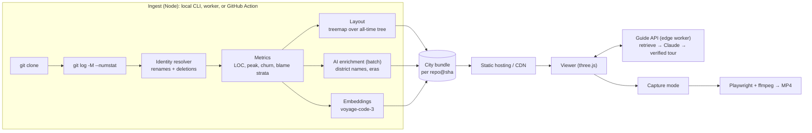

# Architecture

Commitropolis turns a Git repository into a 3D city you can fly through. Folders are districts, files are buildings (height = lines of code), and the commit history plays back as a timelapse in which the city is built and demolished. An AI guide answers "show me where X happens" by flying the camera through the relevant code.

For why it is built this way, see [RESEARCH.md](RESEARCH.md).

> **The city now has a universe around it.** The Commitverse layer (galaxy, worlds, landing) lives in `index.html` and `src/universe/`. It is documented in [UNIVERSE_TECH.md](UNIVERSE_TECH.md), and its rules are in [LORE.md](LORE.md). This document covers the city: `city.html`, `src/*.js` and `ingest/`. A world hands over to a city with `city.html?repo=<slug>&from=<login>&arrive=1`.

## Goals

1. Any public repo becomes a city in under 30 s for typical repos (prebaked for famous ones).
2. **Correct history:** the timelapse reflects what really happened, including renames and deleted code.
3. **Broadcast-quality video export:** deterministic, 60 fps, 16:9 and 9:16.
4. **A grounded AI guide:** every location the AI names is verified against the code before the camera goes there.
5. **Linux-scale:** about 100k buildings at 60 fps.

**Non-goals (v1):** replacing the IDE, which studies show code cities don't do well ([RESEARCH.md](RESEARCH.md#research)); private repos on the hosted site (the local CLI covers them); real-time collaboration.

## System overview



**Principle: precompute per `repo@sha`, serve static.** All the expensive work (clone, history walk, layout, LLM labelling, embeddings) happens once per commit SHA. The result is an immutable bundle that a CDN can cache forever. The viewer is a static page. Only the interactive guide needs a server, and even its answers are cached.

## 1. Ingest pipeline (`ingest/`)

| Step | Status | Notes |
|---|---|---|
| Resolve source (GitHub URL, `owner/repo`, or local path) and clone into `.cache/repos/` | ✅ MVP | Full clone: `--numstat` needs blobs. The planned on-demand service caps repo size. |
| Final state: `git ls-files` + line counts | ✅ MVP | Skips binaries, files > 2 MB, lockfiles, vendored and build output (`IGNORE` list). |
| History: `git log --no-merges -M --numstat`, newest → oldest | ✅ MVP | One pass, streamed from a single `git` process. |
| **Identity resolution** | ✅ MVP | See below. |
| Per-building stats: peak LOC, commit count, first/last touch | ✅ MVP | A forward replay. |
| Layout | ✅ MVP | See §3. |
| `.commitropolisignore` | planned | gitignore syntax, merged with the defaults. |
| Code strata (`git blame --line-porcelain` → line-age histogram per file) | planned | Only for standing files; parallelised; skipped for huge repos. |
| Import graph (roads) | later | Tree-sitter; language-dependent. |

### Identity resolution

A building is a **file identity**, not a path. We walk history newest → oldest, carrying an `alias: path → building` map that starts with the files at HEAD:

- For a change to `to` with rename source `from`, look up `alias[to]` to find the building, then re-point `alias[from]` to it, because before this commit the file lived at `from`.
- If `to` is unknown, the file doesn't survive to HEAD. It gets a new building marked `alive: 0`, which becomes a ruin in the static view.
- Reusing a path (delete, then later re-create) maps to the same building. That is intentional: same address, new building.
- Two identities can still *end* at the same path: a file is deleted, and later another file is renamed onto its path. A path can also be a file in one era and a folder in another. The layout therefore keys lots by identity, not by name, and ingest fails loudly if any building ends up without a lot.

**Why:** in Express, 66% of all lines ever added live in paths that no longer exist, so an ingest that only knows HEAD would show an empty city for years. After this change, 5,686 of 5,688 non-merge commits appear in the timelapse, up from 3,020.

**Known limits:** rename detection is git's similarity heuristic (`-M`, 50%); split and merged files aren't tracked as such; merge commits are skipped, so their changes appear through the commits they bring in.

## 2. City bundle format

**v1 (MVP):** a single JSON file, `public/data/<slug>.json`, plus `index.json` listing the available cities.

```jsonc
{
  "version": 1,
  "repo": { "name": "expressjs/express", "url": "https://github.com/expressjs/express", "head": "<sha>", "generatedAt": "…" },
  "size": 213.46,                      // world units; the city is size × size, centred at the origin
  "districts": [{ "p": "lib", "depth": 1, "x": 8.18, "z": -106.73, "w": 98.55, "d": 78.74 }],
  "files": [{
    "p": "lib/router/index.js",        // last known path (the router was extracted in Express 5)
    "loc": 0, "peak": 658, "alive": 0, // lines at HEAD, peak lines ever, still standing?
    "c": 151, "first": 1303751334, "last": 1675851973,  // commits, first/last touch (unix s)
    "x": 66.23, "z": -99.71, "w": 8.79, "d": 8.94       // lot on the ground plane
  }],
  "authors": ["dependabot[bot]", "…"],
  "commits": [{ "h": "9998490f93", "t": 1246042578, "a": 382, "s": "Initial commit", "c": [719, 4, 0, 720, 29, 0 /* building, added, deleted, … */] }]
}
```

Express comes to 727 buildings and 5,686 commits, 687 KB raw.

**v2 (scale), planned.** The data is split into immutable files, all keyed by `repo@sha`:

- `city.json`: metadata, districts, and buildings as **columnar arrays** (typed-array friendly).
- `history.bin`: **time-bucketed deltas.** For each frame bucket, varint/delta-encoded `(building, netLoc, touches, sign)`. Per-commit resolution is kept below about 50k commits; above that we bucket to about 3,000 frames, which is all a 40–60 s timelapse can show anyway.
- `strata.bin`: line-age histograms for the code strata view.
- `vectors.bin`: embeddings, Matryoshka-truncated to 256 dims and stored as `int8`. They ship to the browser only for small and medium repos; otherwise they stay server-side.
- `ai.json`: district names and purposes, eras, key events.

Budget: under 10 MB gzipped for the typical popular repo. Linux-class repos get bucketed history, and their headline artifact is the pre-rendered video.

## 3. Layout (`ingest/layout.mjs`)

- **Squarified treemap** (Bruls, Huizing & van Wijk) over the folder tree. Padding between a district's edge and its contents forms the streets, and it thins with depth.
- **Footprint ∝ √(peak LOC)** and **height ∝ LOC^0.55**. Footprint grows slower than height, so small files stay visible next to huge ones. Using *peak* LOC keeps lots stable, and because the lot size never changes, nothing moves during the timelapse.
- **Computed once, over the all-time tree:** every file that ever existed has a lot. The timelapse then only changes heights and never positions. That avoids the classic pitfall of a layout recomputed per commit, where buildings jump around.
- **Trade-off:** the static HEAD view has vacant lots where demolished code stood. We show them as dark rubble, which tells a story of its own. Planned: an optional **compact HEAD layout** plus a morph transition at the end of the timelapse (buildings slide into the compact city).
- **Later:** a **semantic layout** (2D projection of file embeddings, UMAP or similar), morphable from the folder layout. It shows where related code is scattered across folders.

## 4. Renderer (`src/city.js`, `src/materials.js`, `src/atmosphere.js`, `src/main.js`)

Plain **three.js** (WebGL2) without React/R3F. We want direct control over instancing, shaders and the capture loop.

### Visual language: every light means something

| Element | Encodes | How |
|---|---|---|
| Lit windows | **Recency of work**: `lit = 0.03 + 0.55·e^(−age/halfLife)`, plus a boost for hot files | Per-instance `aLit`; a hash per window cell decides which are on. In the timelapse, `age` is measured from the replayed "now", so untouched parts of the city go dark over time. |
| Neon crown | The district's hue, brighter where work is recent | Emissive band near the top of each facade |
| District outline + street lamps | Folder boundaries | Plate shader: distance to the plate edge in world units |
| Commit beam | One commit touching one file: warm for growth, red for deletion | Additive cylinders in a ring buffer (`src/beams.js`), height ∝ log(lines changed) |
| Flash | The same commit, on the building itself | Per-instance `aHeat`: above 1 it washes the facade and lights nearly all windows |
| Rubble | A deleted file | Flat dark slab on its lot (`aRuin`) |
| Spire with a red light | The largest files | Separate instanced spires and blinking lamps |

- **Two building shapes, both instanced.** Blocks, and setback towers for tall, slender files (three tiers). Each shape is one `InstancedMesh`, so the whole city is a handful of draw calls.
- **Procedural facades, no textures.** A patched `MeshStandardMaterial` (`onBeforeCompile`) derives the window grid from each instance's scale, so windows are the same size in world units on every building. Unlit windows are glossy metal and reflect the sky. When a window is smaller than a few pixels, the grid **fades to its average** (via `fwidth`) instead of shimmering.
- **Atmosphere.** A sky dome with a horizon glow and stars; an environment map made from that sky (PMREM), so glass reflects the night; fog matched to the horizon; moonlight with shadows; a ground grid that fades out.
- **Post-processing.** HDR half-float target with 4× MSAA → UnrealBloom (threshold above 1, so only real light sources glow) → ACES tone mapping → vignette and film grain.
- **Labels.** CSS2D labels for the biggest top-level districts, fading with camera distance. Districts with no standing files are labelled "demolished".
- **Picking** raycasts both instanced meshes and maps `instanceId` back to the building (O(n), fine to about 50k). Planned: a GPU ID-buffer picker for 100k+.
- **Camera.** It circles slowly until the user touches it. Fly-to moves along an eased arc. The URL (`?repo=&focus=`) holds the view, so any link reproduces it.

**Why procedural and not asset packs.** Every building has a size that comes from the data: a unique footprint and height. Stock models stretched to arbitrary proportions look wrong, and they can't carry per-window meaning. The shader approach also stays one draw call per shape at any scale.

**Scale plan.** The prototype rewrites every instance matrix per timelapse frame, which is O(N) CPU and fine to about 50k buildings. For Linux-class repos:

1. **Sparse, event-driven updates.** Per-instance attributes `(h0, h1, t0)` and `(lastTouch, sign)`. The vertex shader eases height and computes glow from `uTime`, so CPU work per frame is proportional to the buildings changed in that frame, not to N.
2. **LOD.** Distant districts collapse into single blocks (the merged footprint at the max height percentile) and expand as the camera approaches.
3. **WebGPU** via three's `WebGPURenderer` once the capture path is stable, as an optional upgrade.

## 4b. Code view: entering a building (`src/reader.js`)

**A building is its file, and its floors are its lines, bottom-up.**

- **Opening a building** (double-click, `Enter`, or the button) fetches the file from `raw.githubusercontent.com` at the bundle's `head` SHA. That host serves CORS, so no server is needed. highlight.js is lazy-loaded as a separate chunk, so the first page load doesn't pay for it.
- **Elevator.** Scrolling reports the visible line range. `bandOf()` maps it to a band of floors, the shader lights that band cyan (`uFocus`, `uBand`), and the camera eases to face that height. `camera.setViewOffset` shifts the projection so the building sits left of the code panel.
- **X-ray.** In a dense city, neighbours block the view. While a building is open, fragments of *other* buildings near the segment camera → focus are discarded with a dithered falloff (`uCamPos`, `uFocusPos`, `uTunnel`). This is the cutaway trick games use. It is cheaper and more robust than searching for an unobstructed camera angle.
- Local repositories, which have no GitHub URL, can't show code yet. Planned: serve file contents from the ingest cache in dev mode.

## 4c. Offline renderer: Blender (`tools/blender/render_city.py`)

This renderer is for posters, README heroes, wallpapers and social thumbnails. It reads the same bundle and uses the same visual language, but path-traces with **Cycles**.

- **Geometry.** All buildings go into one mesh. Side faces get **UVs in world units** (u along the face, v up from the base), so a single shader-node window grid works on every building. Per-face attributes (`lit`, `seed`, `top_h`, `ruin`, `face_id`, `hue`) drive the same rules as the web shader.
- **Materials.** Windows are metallic glass when unlit and emissive (warm or cool) when lit. The street is wet asphalt: a noise-driven roughness gives mirror-like puddles. District frames are emissive in the district's hue. Commit beams are emission added to transparency.
- **Atmosphere.** A world gradient with stars, plus **haze in a bounded box** around the city. A world volume would be infinitely deep and swallow the sky.
- **Output.** Blender 5 compositor (`scene.compositing_node_group`) with Glare → Bloom, and AgX (Punchy) view transform. It renders on the GPU (OptiX, then CUDA, then CPU) with denoising.
- `--at YYYY-MM-DD` replays history to that day, which gives true "then vs now" pairs from the same camera.
- **Next:** keyframed Blender animation of the timelapse, for the hero video.

## 5. Timelapse (`src/timelapse.js`)

- **Now:** replays commits at a constant commits-per-second rate (default: whole history in 40 s). Heights ease toward their targets, and touched buildings flash (warm for growth, red for deletion). Scrubbing re-applies history up to the target commit; this is cheap for per-commit data, and bucketed data makes it cheap at scale too.
- **Planned:**
  - Pacing by calendar time vs by commit count, with a speed curve.
  - An era caption track (see §6).
  - Day/night following each commit's local hour (credit: maximalcode/git-city).
  - Colour modes: district, language, author, recency, age strata.
  - The end-of-history morph to the compact layout.

## 6. AI layer

Three principles:

- **Grounded:** every location the AI returns is a `path + line range + verbatim quote`, and we verify it.
- **Precomputed per `repo@sha`:** browsing the gallery costs nothing.
- **Keys never ship to the browser.**

### 6a. Ingest-time enrichment (batch)

Runs through the **Message Batches API** (asynchronous, 50% cost), with **prompt caching** on the shared repo-overview prefix (README excerpt + tree).

- **District naming.** Input: the folder path, its file list, the first lines of its largest files, and the README excerpt. Output via **structured outputs** (`output_config.format`, JSON schema): `{ name, purpose, confidence }`. Example: `lib/router` → "Request routing".
- **Eras (chapters).** Change-point detection on weekly churn per district is statistical and involves no LLM. For each era, the model reads sampled commit subjects plus stats and returns `{ title (≤ 6 words), summary, keyEvents: [{ date, commit, description }] }`. Eras feed the timelapse captions and the video director.
- **File summaries** (optional) for the largest and hottest files, as extra retrieval text.
- **Model:** `claude-opus-5-5` at `effort: "low"` for labelling. We measure label quality on a sample before considering anything cheaper.

### 6b. Retrieval

- **Embeddings from Voyage AI**, since Anthropic doesn't offer an embedding model and its docs point to Voyage. We use `voyage-code-3` for code, with `input_type: "document"` for chunks and `"query"` for questions. Chunks follow top-level symbols (or about 120-line windows) with a path header.
- Vectors are Matryoshka-truncated to 256 dims and quantised to `int8` for storage and shipping.
- **Hybrid search:** dense vectors plus BM25 over paths and identifiers. The MVP's path search in `src/search.js` becomes the lexical leg. An optional reranker (`rerank-2.5`) reorders the top 50.

### 6c. The guide: "show me where login happens"

```
query ─► embed (voyage-code-3, query) ─► top-k chunks (k≈20, hybrid)
      ─► Claude (claude-opus-5-5, effort medium)
           system (cached): guide instructions + repo overview + district names
           user: question + retrieved chunks (path + line numbers)
           output_config.format → { answer, stops: [{ path, startLine, endLine, quote, narration }], confidence }
      ─► verify each stop: path exists in the bundle AND quote occurs within [startLine, endLine] at repo@sha
      ─► viewer: fly stop → stop, narration as captions (TTS optional)
```

- **Verification is the product.** Stops that fail are dropped, or get one repair round. Only verified stops move the camera, and low confidence is shown to the user.
- We use **structured outputs** rather than forced tool calls, because `claude-opus-5-5` rejects forced `tool_choice`. The API's **Citations** feature fits free-text answers, but it can't be combined with `output_config.format`, which is why the tour carries its own verified quotes.
- **Caching:** `cache_control` on the stable prefix (system + repo overview). Answers are cached per `(repo@sha, normalised query)`.
- Tours serialize to the URL, so they are shareable and replayable, and they can be rendered to video (§7).

### 6d. The AI director (videos)

Given the eras, the key events and the city geometry, Claude writes a **shot list** as JSON: keyframes of `{ t, target (path/district), distance, azimuth, elevation, caption }`. We validate it (targets exist, pacing stays within limits), and the capture pipeline renders it. A human can edit the JSON before rendering.

## 7. Video pipeline (`tools/video/`)

- **Capture mode (`?capture`).** There is no rAF loop, and the drawing buffer is preserved. `window.commitropolis.stepFrame(dt)` and `window.commitverse.stepFrame(dt)` advance the simulation, the camera and the render deterministically.
- **Director mode (`?director`).** A director script owns the camera, the captions and the timing. It hides the HUD, turns off CSS transitions, and sets every fade itself from its own clock. With `?capture` added, it waits to be stepped. The universe part is `src/universe/director.js` (the galaxy as of each year, the dive, the world, the landing). The city part is `src/cityDirector.js` (arrival, timelapse, the elevator, the end card). Camera paths are monotone cubic curves through keyframes, so nothing overshoots.
- **Driver (`capture.mjs`).** Playwright runs headless Edge or Chrome on the GPU (ANGLE/D3D11), steps each director by exactly 1/30 s, screenshots the page (WebGL plus DOM captions) and pipes JPEG frames to ffmpeg. The two parts join on a white frame: the universe ends in the clouds, and the city begins in them. The run also writes a cue sheet: when each rocket and asteroid in the city happened.
- **Score (`score.mjs`).** The soundtrack is synthesised, with no samples: pads, Karplus-Strong plucks, FM bells, drums, risers and booms, plus Freeverb. It follows the film's timeline, and the city's impacts are placed from the cue sheet.
- Capture from `vite preview`, not the dev server: hot reload would interrupt the run.
- **Gallery:** a weekly scheduled GitHub Action ingests a curated list of famous repos, renders their videos, and publishes the bundles and MP4s.

## 8. Hosting and distribution

| Phase | What |
|---|---|
| 1 | Static site on GitHub Pages ([workflow](../.github/workflows/pages.yml)) with prebaked bundles. `npm run ingest -- <repo>` handles any repo locally, private ones included. |
| 2 | On-demand ingest for public repos: a queue, a container worker with a disk cache of clones, and limits (pack size, commit count). Bundles go to object storage, deduplicated by `repo@sha`. |
| 2 | Guide API on an edge worker that holds the Anthropic and Voyage keys. It is rate-limited per IP and caches answers in KV. |
| 3 | Growth loops: **URL swap** (`github.com/o/r` → `<domain>/o/r`), a **README Action/badge** that renders your repo's timelapse, **share cards**, a **compare view**, an **embeddable iframe**, and an **MCP server** ("show this code in the city"). |

## Decisions

| # | Decision | Why |
|---|---|---|
| 1 | Layout computed once over the **all-time** tree | Nothing moves during the timelapse, demolitions are visible, and the history stays honest (the Express numbers above). |
| 2 | Follow renames at ingest (`git log -M`) | One building per file identity. |
| 3 | Precompute per `repo@sha`; the viewer is static | Cheap, cacheable and fast; the gallery costs nothing to serve. |
| 4 | Plain three.js, no React/R3F | Direct control over instancing, shaders and the capture loop. |
| 5 | Voyage embeddings; Claude for generation | Anthropic has no embedding model and recommends Voyage. |
| 6 | Deterministic capture instead of screen recording | No dropped frames, and results are reproducible. This is the method Gource videos use. |
| 7 | Verified tours instead of a chat panel | The camera must never fly to a hallucinated location. |
| 8 | Procedural buildings and shaders, not asset packs | Sizes come from the data, and each window carries meaning; it also stays a few draw calls at any scale. |
| 9 | Floors = lines of code | Connects the 3D view with the code: reading a file is riding up its building. |
| 10 | X-ray cutaway instead of camera collision avoidance | A dense treemap city has no clear sightlines; dissolving occluders always works. |
| 11 | Blender/Cycles for stills, three.js for interaction | Path tracing gives poster quality from the same data, with no compromise in the live viewer. |

## Roadmap

- **M0: done.** Ingest with rename and demolition identity; all-time layout; instanced renderer with bloom; timelapse with scrubbing; path search with fly-to; deep links; capture hooks.
- **M0.5: done.** The night-city visual language (lit windows = recency, neon crowns, commit beams, towers, spires, labels); entering a building (code view, floors = lines, elevator, x-ray); Blender poster renderer; layout fix for identities that share a path.
- **M1: the first video.** Capture driver (Playwright + ffmpeg), camera keyframes, date and caption overlay, 16:9 and 9:16. Ship "Express: 17 years in 30 seconds", then React. Option: a keyframed Blender animation for the hero cut.
- **M2: scale.** Binary bundle, time buckets, sparse GPU updates, LOD. Target: Linux.
- **M3: the AI guide.** Voyage embeddings, the guide API with verified tours, district names, eras.
- **M4: distribution.** Gallery site, URL-swap domain, README Action/badge, share cards, compare mode, MCP server.
- **M5: more signature visuals.** Code strata (blame age per floor), a facade minimap of the code seen up close, the semantic layout morph, day/night by commit hour.

## Risks

| Risk | Mitigation |
|---|---|
| Crowded idea: "another code city" | Ship the video first (M1) and lead with honest history. The quality of the output is the moat. |
| The LLM names locations that don't exist | Verification layer (§6c); show confidence; never fly to an unverified stop. |
| LLM and embedding cost | Precompute per SHA, use the Batch API and prompt caching, cache answers, rate-limit per IP. |
| Big-repo ingest time and cost | Prebake famous repos; size limits for on-demand ingest; bucketed history. |
| GitHub API rate limits | We clone and never use the API for history. |
| Name or domain collisions | Checked on GitHub (RESEARCH.md). The domain is still open. |
